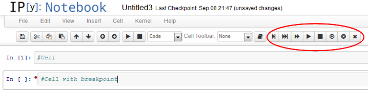

After installation these buttons should appear on the toolbar:

The extension adds 8 buttons:

Installation
============

Follow the installation instructions appropriate to your IPython version as explained on the main wiki home pages:
* [Home generic](Home)
* [Home 4.x (Jupyter)](Home-4.x-(Jupyter))
* [Home 3.x](Home-3.x)
* [Home 2.x](Home-2.x)

Internals
=========

The extension registers a codemirror gutter. Currently, this makes it incompatible with the codefolding-extension, as both extensions react on gutter clicks. 

A breakpoint flag is stored as metadata in each cell:
`cell.metadata.run_control.breakpoint = true | false`

As metadata is saved in the IPython notebook, all breakpoints are saved, too.
