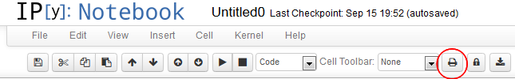

This extension adds a button to the toolbar that calls nbconvert on the notebook server:

When pressing the button on the toolbar, the following python command is executed:

`ipython nbconvert --profile=<current profile> --to html <notebook name>`

This leaves the resulting static html file from your notebook in the directory where the notebook resides. Additionally, a new tab in the browser is opened and the generated static html file of the notebook is displayed.

Your current profile is used to call nbconvert, allowing you to specify your own templates, pre- and postprocessors. 

Installation
============

Follow the installation instructions appropriate to your IPython version as explained on the main wiki home pages:
* [Home generic](Home)
* [Home 4.x (Jupyter)](Home-4.x-(Jupyter))
* [Home 3.x](Home-3.x)
* [Home 2.x](Home-2.x)

Internals
=========

Newer IPython versions (> 2.0) will have the ability to operate with subdirectories in the URL.
This extension takes this into account by checking the IPython notebook version and generating the correct path.
