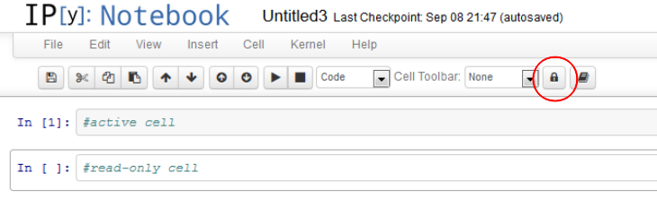

Clicking on the lock symbol makes the current cell read-only. This means it can be executed, but the input area cannot be altered. This behavior is persistant, i.e. the information is stored as metadata in the ipynb file. Even when the read-only extension is not loaded, the read-only information is kept, but not applied to the cell.


Customization
-------------

The read-only information is stored in the metadata field of the codecell
```
run_control.read_only = true | false
```
and stored in the IPython notebook.


Installation
============

Follow the installation instructions appropriate to your IPython version as explained on the main wiki home pages:
* [Home generic](Home)
* [Home 4.x (Jupyter)](Home-4.x-(Jupyter))
* [Home 3.x](Home-3.x)
* [Home 2.x](Home-2.x)
