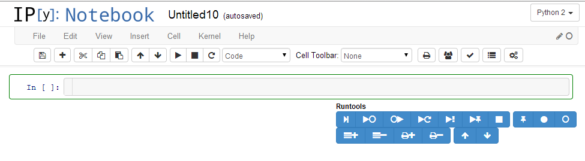
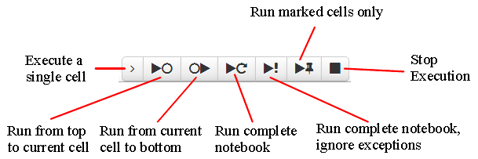
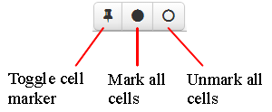
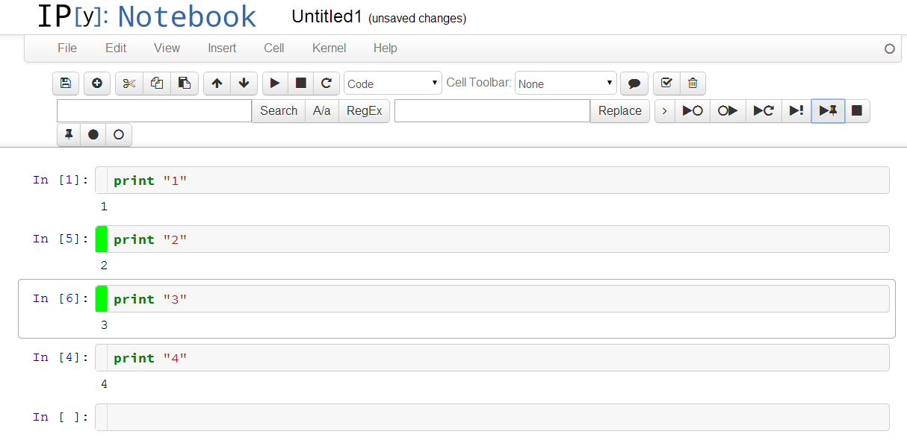

Runtools provide a number of additional functions for working with code cells in the IPython notebook:

Code Cell Execution
===================

* Execute a single cell
* Execute from top cell to currently selected cell
* Execute from currently selected cell to bottom cell
* Execute all cells
* Execute all cells, ignore exceptions (requires https://github.com/ipython/ipython/pull/6521)
* Execute marked code cells (cells with green gutter area are marked)
* Stop execution (duplicate to standard toolbar button)

Code Cell Marking
=================

* Mark one or more code cell

Code Cell Display
=================

* Hide or show input (i.e. the source code) of marked code cells
* Hide or show output of marked code cells

Description
===========

The *runtools* extension adds a button to turn on/off a floating toolbar:

This adds Code execution buttons:

Codecells can be marked by clicking on the gutter of a codecell or by clicking on the markers toolbar:

A IPython notebook with marked cells looks like this:

Installation
============

Follow the installation instructions appropriate to your IPython version as explained on the main wiki home pages:
* [Home generic](Home)
* [Home 4.x (Jupyter)](Home-4.x-(Jupyter))
* [Home 3.x](Home-3.x)
* [Home 2.x](Home-2.x)

Internals
=========

New metadata elements added to each cell:
* `cell.metadata.hide_input` - hide input field of the cell
* `cell.metadata.hide_output` - hide output field of the cell
* `cell.metadata.run_control.marked` - mark a codecell
