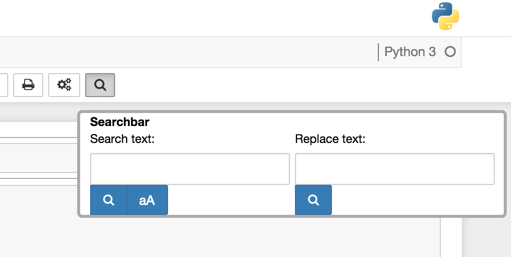

This extension provides a notebook-wide search & replace toolbar.

It uses the codemirror `search` and `searchcursor` add ons.  

Installation
============

Follow the installation instructions appropriate to your IPython version as explained on the main wiki home pages:
* [Home generic](Home)
* [Home 4.x (Jupyter)](Home-4.x-(Jupyter))
* [Home 3.x](Home-3.x)
* [Home 2.x](Home-2.x)
