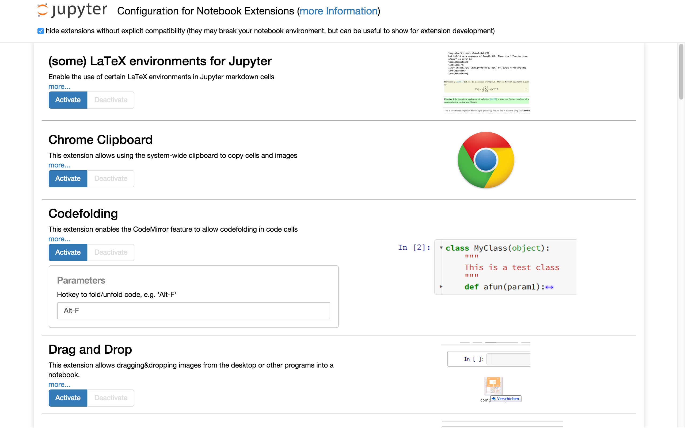

There is a graphical user interface for activating/deactivating installed notebook extensions available at the '/nbextensions' URL:



This is realized using a notebook server extension, new to IPython 3.x. 
In order to work, this config extension needs to be installed, and notebook extensions require a YAML description file in under the `nbextensions` directory (see installation notes, below) in order to be found.


Setup procedure
===============


1. Installation
---------------

All required files for the configuration page are originally located in the 'config' subdirectory of the repository.
 * copy `nbextensions.py` to your `~/.ipython/extensions` folder (for 3.x or 4.x)
 * copy `nbextensions.html` and `rendermd.html` to your `~/.ipython/templates` folder (for 3.x or 4.x)
 * copy `main.js` and `main.css` to the `nbextensions/config/` directory, which can be found:
   * for IPython 3.x, inside your `~/.ipython` folder, so `~/.ipython/nbextensions/config/`
   * for Jupyter notebook (4.x), inside the folder given by running 
     ```
     from jupyter_core.paths import jupyter_data_dir;
     print(jupyter_data_dir())
     ```
   in an ipython terminal. This varies between platforms, e.g. on Mac OSX, it outputs the expanded version of
   `~/Library/Jupyter`, meaning we should put them in
   `~/Library/Jupyter/nbextensions/config/`.


2. Configuration
----------------

To enable the config extension, you'll need to edit your notebook config file.
In 3.x, this is in your profile directory, e.g. `~/.ipython/profile_default/ipython_notebook_config.py`
whereas in Jupyter 4.x, it's `~/.jupyter/jupyter_notebook_config.py` (since Jupyter doesn't have a concept of profiles).

Add the following lines:
```
from IPython.utils.path import get_ipython_dir
import os
import sys

ipythondir = get_ipython_dir()
extensions = os.path.join(ipythondir,'extensions') 
sys.path.append( extensions )

c = get_config()
c.NotebookApp.server_extensions = ['nbextensions']
c.NotebookApp.extra_template_paths = [os.path.join(ipythondir,'templates') ]
```


YAML file format
================

The YAML file can have any name with the extension `YAML`, and describes the notebook extension. Note that keys (in bold) are case-sensitive.

* **Type**          - identifier, must be 'IPython Notebook Extension'
* **Name**          - unique name of the extension
* **Description**   - short explanation of the extension
* **Link**          - a url for more documentation
* **Icon**          - a url for a small icon (rendered 120px high, should preferably end up 400px wide. Recall HDPI displays may benefit from a 2x resolution icon).
* **Main**          - main javascript file that is loaded, typically 'main.js'
* **Compatibility** - IPython version compatibility, e.g. '3.x' or '4.x' or '3.x 4.x'
* **Parameters**    - Optional list of configuration parameters. Each item is a dictionary with (some of) the following keys:
  * **name**        - (mandatory) this is the name used to store the configuration variable in the config json, so should be unique among all extensions
  * **description** - description of the configuration parameter
  * **default**     - a default value used to populate the tag on the nbextensions config page. Note that this is more of a hint to the user than anything functional - since it's only set in the yaml file, the javascript implementing the extension in question might actually use a different default, depending on the implementation.
  * **input_type**  - controls the type of html tag used to render the parameter on the configuration page. Valid values include 'text', 'textarea', 'checkbox', [html5 input tags such as 'number', 'url', 'color', ...], plus a final type of 'list'
  * **list_element** - for parameters with input_type 'list', this is used in place of 'input_type' to render each element of the list
  * finally, extras such as **min** **step** **max** may be used by 'number' tags for validation

Example:

```yaml
Type: IPython Notebook Extension
Name: Limit Output
Description: This extension limits the number of characters that can be printed below a codecell
Link: https://github.com/ipython-contrib/IPython-notebook-extensions/wiki/limit-output
Icon: icon.png
Main: main.js
Compatibility: 3.x 4.x
Parameters:
- name: limit_output
  description: Number of characters to limit output to
  input_type: number
  default: 10000
  step: 1
  min: 0
```
