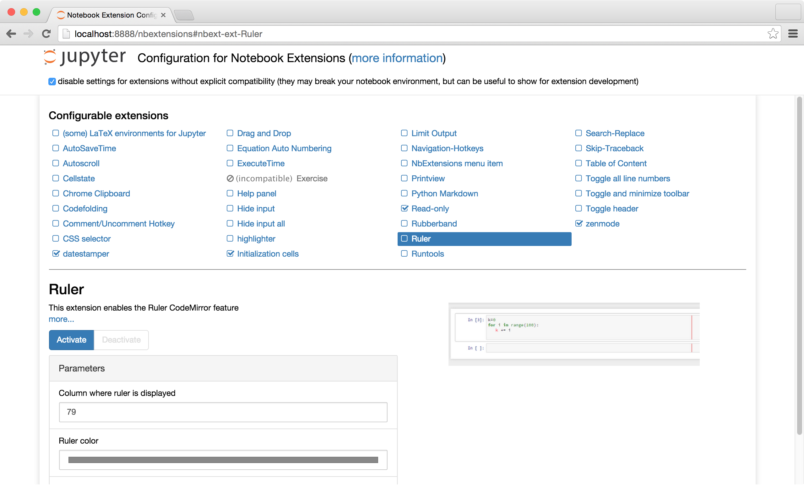

There is a graphical user interface for activating/deactivating installed notebook extensions available at the `/nbextensions` URL:



This is realized using a notebook server extension, new to IPython 3.x. 
In order to work, this config extension needs to be installed, and notebook extensions require a YAML description file in under the `nbextensions` directory (see installation notes, below) in order to be found.


Setup procedure
===============

**For Jupyter/IPython 4.x**, a (verified) way to install this extension, along with others in the repository, is to clone master branch from repository and execute `python setup.py install` on the master branch directory.
**Important:** _the actions executed by the `setup.py` script are described in the [master-branch README.md file](https://github.com/ipython-contrib/IPython-notebook-extensions#setuppy). Read before using!_
You only need the instructions below to perform a manual installation.


1. Gather information
---------------------
__Locate your Jupyter/IPython config and data directories__


#### For Jupyter/IPython 3.x:

* To find your IPython __data directory__, open ipython and execute the following:

  ```Python
  from __future__ import print_function
  from IPython.utils.path import get_ipython_dir
  print(get_ipython_dir())
  ```

* In 3.x, your IPython __config directory__ is just your profile directory. To find your profile directory, open ipython and execute the following (note this will only work if your notebook server is run with your default ipython profile. If it's not, you'll need to use the server's profile directory):

  ```Python
  from __future__ import print_function
  from IPython.utils.path import get_ipython_dir
  print(get_ipython().profile_dir.location)
  ```


#### For Jupyter/Ipython 4.x:

* To find your Jupyter __data directory__, open ipython and execute the following:

  ```Python
  from __future__ import print_function
  from jupyter_core.paths import jupyter_data_dir, jupyter_path
  print(jupyter_data_dir())
  print(jupyter_path())
  ```

  The `jupyter_data_dir()` shows you where *local* extensions and templates can be installed.  
  The `jupyter_path()` shows you directories which are searched for *globally* installed extensions and templates.

* To find your Jupyter __config directory__, open ipython and execute the following:

  ```Python
  from __future__ import print_function
  from jupyter_core.paths import jupyter_config_dir, jupyter_config_path
  print(jupyter_config_dir())
  print(jupyter_config_path())
  ```

  Similarly to the data directory,  
  `jupyter_config_dir()` shows you where your *local* configuration files are stored.  
  `jupyter_config_path()` shows you where Jupyter will look for *global* configuration files.


2. Installation
---------------

#### For Jupyter/IPython 3.x:

All required files for the configuration page are originally located in the 'config' subdirectory of the repository.
 * copy `nbextensions.py` to your `~/.ipython/extensions` folder for 3.x
 * copy `nbextensions.html` and `rendermd.html` to your `~/.ipython/templates` folder for 3.x
 * copy `main.js` and `main.css` to the `nbextensions/config/` directory, which can be inside your `~/.ipython` folder, so `~/.ipython/nbextensions/config/`


#### For Jupyter/Ipython 4.x:

  * make sure directories named `nbextensions`, `extensions`, and `templates` exist in your Jupyter data directory (see step 1. to find it). You may need to create them.
  * copy the `nbextensions/config` folder to sit in the `nbextensions` directory from above
  * copy the `extensions/nbextensions.py` file to sit in the `extensions` directory from above
  * copy the `templates/nbextensions.html` and `templates/rendermd.html` to sit in the `templates` from above


3. Configuration
----------------


#### for Jupyter/Ipython 3.x

To enable the config extension, you'll need to edit your notebook config file.
This is the file `ipython_notebook_config.py` in your config directory (see step 1).

Edit the file to contain the following lines:

```python
from IPython.utils.path import get_ipython_dir
import os.path
import sys

sys.path.append(os.path.join(get_ipython_dir(), 'extensions'))

c = get_config()

c.NotebookApp.extra_template_paths = [os.path.join(ipythondir, 'templates') ]
c.NotebookApp.server_extensions = ['nbextensions']
```


#### for Jupyter/Ipython 4.x

In order to to get the extension to load correctly once it's been installed, you need to edit your `jupyter_notebook_config.py`, which is located inside your Jupyter config directory (see step 1.). Edit the file to contain the following lines:

```python
from jupyter_core.paths import jupyter_config_dir, jupyter_data_dir
import os.path
import sys

sys.path.append(os.path.join(jupyter_data_dir(), 'extensions'))

c = get_config()

c.NotebookApp.extra_template_paths = [os.path.join(jupyter_data_dir(), 'templates') ]
c.NotebookApp.server_extensions = ['nbextensions']
```

This should make sure the notebook javascript extensions are found in the correct 'nbextensions' directory,
the Python server-side extension is found in the correct `extensions` directory,
and the additional templates are found in the correct `templates` directory.


Internals
=========


YAML file format
----------------

The YAML file can have any name with the extension `YAML`, and describes the notebook extension. Note that keys (in bold) are case-sensitive.

* **Type**          - identifier, must be 'IPython Notebook Extension'
* **Name**          - unique name of the extension
* **Description**   - short explanation of the extension
* **Link**          - a url for more documentation
* **Icon**          - a url for a small icon (rendered 120px high, should preferably end up 400px wide. Recall HDPI displays may benefit from a 2x resolution icon).
* **Main**          - main javascript file that is loaded, typically 'main.js'
* **Compatibility** - IPython version compatibility, e.g. '3.x' or '4.x' or '3.x 4.x'
* **Parameters**    - Optional list of configuration parameters. Each item is a dictionary with (some of) the following keys:
  * **name**        - (mandatory) this is the name used to store the configuration variable in the config json, so should be unique among all extensions
  * **description** - description of the configuration parameter
  * **default**     - a default value used to populate the tag on the nbextensions config page. Note that this is more of a hint to the user than anything functional - since it's only set in the yaml file, the javascript implementing the extension in question might actually use a different default, depending on the implementation.
  * **input_type**  - controls the type of html tag used to render the parameter on the configuration page. Valid values include 'text', 'textarea', 'checkbox', [html5 input tags such as 'number', 'url', 'color', ...], plus a final type of 'list'
  * **list_element** - for parameters with input_type 'list', this is used in place of 'input_type' to render each element of the list
  * finally, extras such as **min** **step** **max** may be used by 'number' tags for validation

Example:

```yaml
Type: IPython Notebook Extension
Name: Limit Output
Description: This extension limits the number of characters that can be printed below a codecell
Link: https://github.com/ipython-contrib/IPython-notebook-extensions/wiki/limit-output
Icon: icon.png
Main: main.js
Compatibility: 3.x 4.x
Parameters:
- name: limit_output
  description: Number of characters to limit output to
  input_type: number
  default: 10000
  step: 1
  min: 0
```