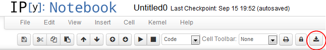

**For IPython version 2 or greater, please use the `File` menu entries for downloading and print preview instead.**

This extension adds a button to the toolbar that calls nbconvert on the notebook server:



When pressing the button on the toolbar, the following python command is executed:
```python
import os; os.system(\"ipython nbconvert --to html ' + name + '\")
```
Where `name` ist the name of the current IPython notebook. 
This leaves the resulting static html file from your notebook in the directory where the notebook resides.


Installation
============

Follow the installation instructions appropriate to your IPython version as explained on the main wiki home pages:
* [Home generic](Home)
* [Home 4.x (Jupyter)](Home-4.x-(Jupyter))
* [Home 3.x](Home-3.x)
* [Home 2.x](Home-2.x)